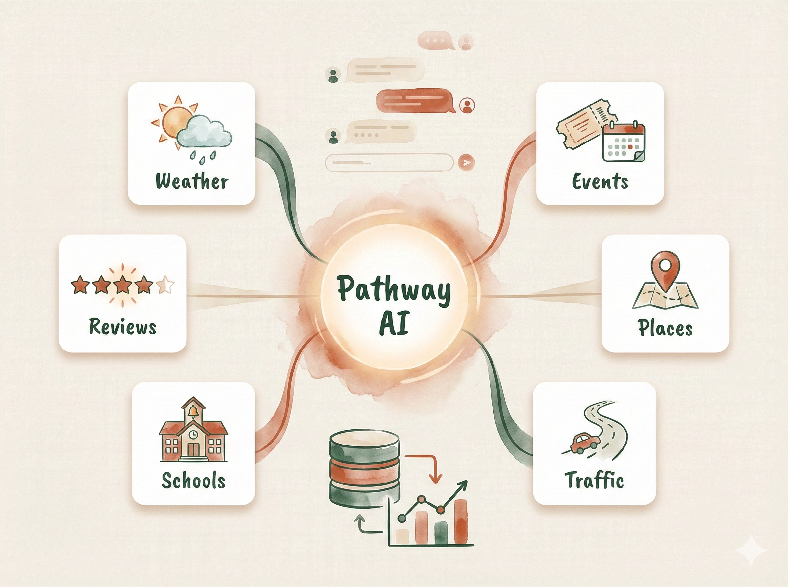
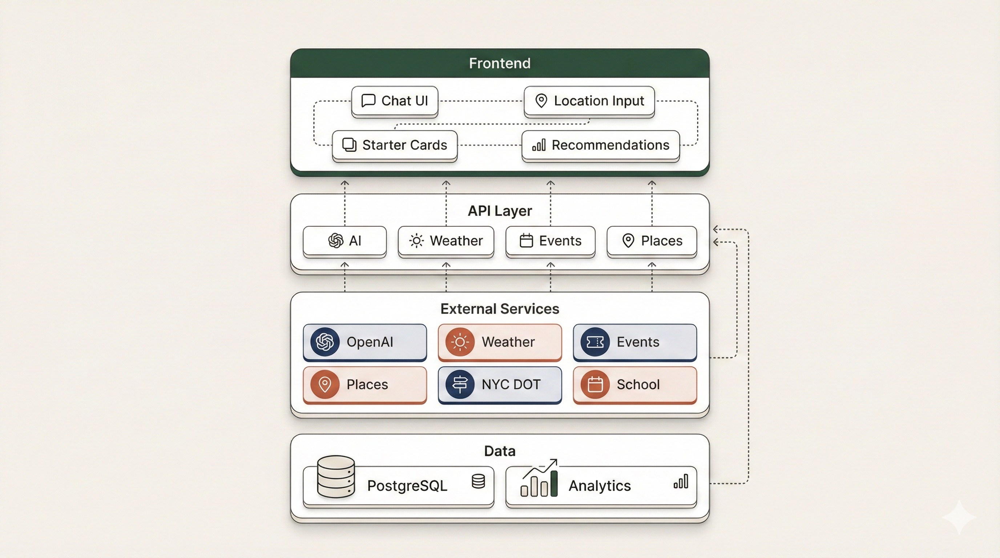
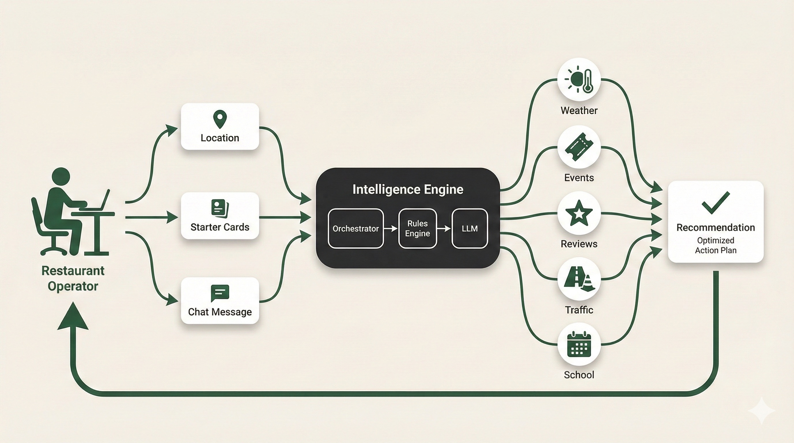
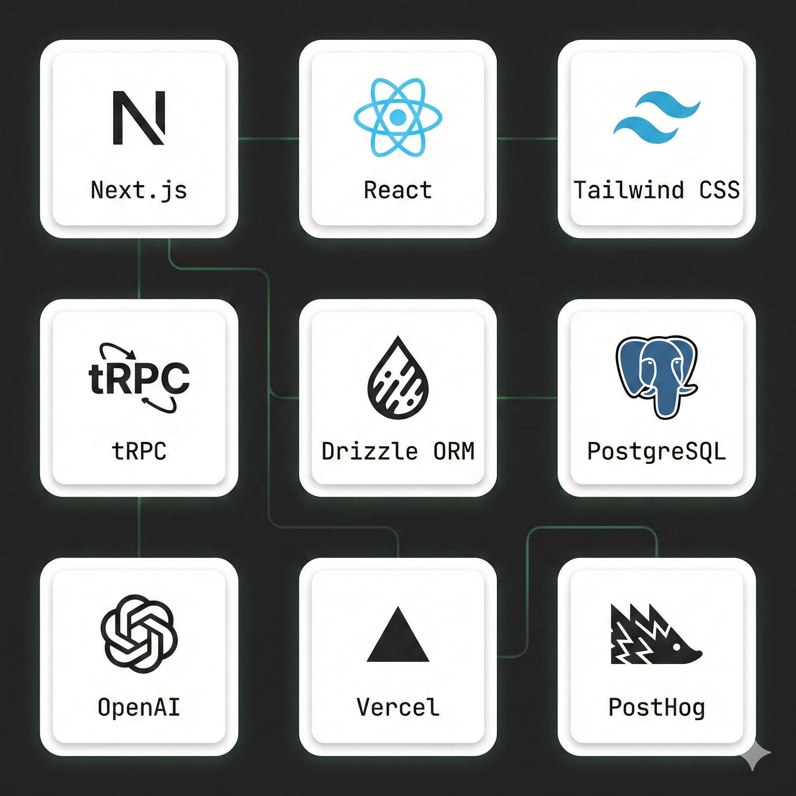

# Pathway - Restaurant Intelligence Chat

An AI-powered chat assistant that helps NYC restaurant operators plan staffing and prep for the next 3 days by analyzing weather, events, street closures, and local conditions.

<p align="center">
  
</p>

**Live:** [pathway-liart.vercel.app](https://pathway-liart.vercel.app)
**Brand Reference:** [workwithpathway.com](https://workwithpathway.com)

---

## What It Does

Pathway answers one question: **"What should I prepare for at my restaurant this week?"**

Users input 1-3 NYC locations and receive actionable recommendations like:

> **Tue 5-9pm:** +1-2 FOH at Hell's Kitchen
> _(confidence: high, source: Ticketmaster MSG event, updated 1h ago)_

The system combines multiple data sources to surface staffing signals that would otherwise require manual research.

---

## Architecture

<p align="center">
  
</p>

The system is organized into four layers: Frontend (Next.js), API Layer (tRPC), External Services, and Data Storage.

---

## Data Flow

<p align="center">
  
</p>

Restaurant operators input their location(s) and select a starter card. The Intelligence Engine orchestrates data fetching from multiple sources, applies rules, and uses an LLM to generate natural language recommendations.

---

## Tech Stack

<p align="center">
  
</p>

| Layer      | Technology                                     |
| ---------- | ---------------------------------------------- |
| Framework  | Next.js 15 (App Router)                        |
| API        | tRPC v11                                       |
| Database   | PostgreSQL (Neon)                              |
| ORM        | Drizzle                                        |
| Styling    | Tailwind CSS v4                                |
| AI         | OpenRouter (Kimi K2.5 + Minimax M2.5 fallback) |
| Analytics  | PostHog                                        |
| Deployment | Vercel                                         |

---

## Project Structure

```
src/
├── app/                    # Next.js App Router
│   ├── _components/        # React components
│   ├── layout.tsx          # Root layout with providers
│   └── page.tsx            # Landing/chat page
├── server/
│   ├── api/
│   │   ├── routers/        # tRPC routers
│   │   │   ├── intelligence.ts # Staffing intelligence chat
│   │   │   ├── ai.ts       # AI utility endpoints
│   │   │   ├── weather.ts  # Weather data
│   │   │   ├── events.ts   # Ticketmaster events
│   │   │   └── places.ts   # Google Places
│   │   ├── root.ts         # Router composition
│   │   └── trpc.ts         # tRPC config
│   ├── db/                 # Drizzle schema
│   └── services/           # External API clients
│       ├── openrouter.ts
│       ├── weather.ts
│       ├── ticketmaster.ts
│       ├── nyc-dot.ts
│       └── google-places.ts
├── styles/
│   └── globals.css         # Tailwind + brand tokens
├── trpc/                   # tRPC client setup
└── env.js                  # Environment validation
```

---

## Getting Started

### Prerequisites

- Node.js 18+
- pnpm
- PostgreSQL database (or use Neon)

### Installation

```bash
# Clone the repo
git clone https://github.com/jachian22/pathway.git
cd pathway

# Install dependencies
pnpm install

# Copy environment variables
cp .env.example .env
# Edit .env with your API keys

# Push database schema
pnpm db:push

# Seed DOE calendar rows (replace seed file with official DOE-normalized rows for production)
pnpm doe:seed

# Start development server
pnpm dev
```

### Environment Variables

| Variable                    | Description                                       | Required |
| --------------------------- | ------------------------------------------------- | -------- |
| `DATABASE_URL`              | PostgreSQL connection string                      | Yes      |
| `OPENROUTER_API_KEY`        | OpenRouter API key                                | Yes      |
| `OPENROUTER_MODEL`          | Primary model ID (default: moonshotai/kimi-k2.5)  | No       |
| `OPENROUTER_FALLBACK_MODEL` | Fallback model ID (default: minimax/minimax-m2.5) | No       |
| `OPENWEATHER_API_KEY`       | OpenWeather API key                               | Yes      |
| `TICKETMASTER_API_KEY`      | Ticketmaster API key                              | Yes      |
| `GOOGLE_PLACES_API_KEY`     | Google Places API key                             | Yes      |
| `NEXT_PUBLIC_POSTHOG_KEY`   | PostHog project key                               | No       |
| `NEXT_PUBLIC_POSTHOG_HOST`  | PostHog host URL                                  | No       |

---

## API Reference

### AI

```typescript
// Chat with message history
api.ai.chat.mutate({
  messages: [{ role: "user", content: "..." }],
});

// Simple prompt
api.ai.prompt.mutate({
  prompt: "...",
  systemPrompt: "...",
});
```

### Weather

```typescript
// Current weather by coordinates
api.weather.current.query({ lat: 40.7, lon: -74.0 });

// Current weather by city
api.weather.currentByCity.query({ city: "New York" });

// 5-day forecast
api.weather.forecast.query({ lat: 40.7, lon: -74.0 });
```

### Events

```typescript
// Search events
api.events.search.query({
  city: "New York",
  radius: 10,
  category: "music",
});

// Get event details
api.events.getById.query({ eventId: "..." });
```

### Places

```typescript
// Search places
api.places.search.query({
  query: "pizza",
  lat: 40.7,
  lon: -74.0,
});

// Get place details with reviews
api.places.details.query({ placeId: "..." });
```

---

## Brand Guidelines

See [BRAND.md](./BRAND.md) for:

- Color palette (cream, charcoal, forest green)
- Typography (Playfair Display + Geist Sans)
- Chat UI component classes
- Design rationale

---

## Documentation

| Document                                                                               | Description                          |
| -------------------------------------------------------------------------------------- | ------------------------------------ |
| [BRAND.md](./BRAND.md)                                                                 | Visual identity and component styles |
| [docs/restaurant-intelligence-v1.1.md](./docs/restaurant-intelligence-v1.1.md)         | Product spec and contracts           |
| [docs/agent-design-decisions.md](./docs/agent-design-decisions.md)                     | Architecture decisions               |
| [docs/analytics-emission-plan.md](./docs/analytics-emission-plan.md)                   | Analytics implementation             |
| [docs/landing-page-chat-analytics-spec.md](./docs/landing-page-chat-analytics-spec.md) | Metrics and dashboards               |

---

## Deployment

The app is configured for Vercel deployment:

```bash
# Deploy to Vercel
vercel

# Or push to main branch for automatic deployment
git push origin main
```

Remember to add all environment variables in Vercel project settings.

---

## License

Private - All rights reserved.
